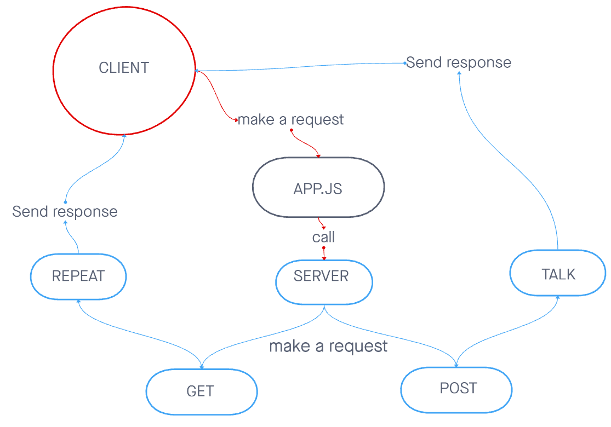

# server-deployment-practice

# Express Server
Created by Bryce FPingston

## Installation  
npm i { jest, express, dotenv, supertest }  
  
## Summary of Problem Domain  
Setting up, installing, and testing the server. Making sure that the server communicating requests, and passing tests.  
## Links to application deployment  

Githut: https://github.com/bpfingston/server-deployment-practice  
Heroku: https://server-deployment-main-pract.herokuapp.com/  
Post: https://server-deployment-main-pract.herokuapp.com/talk  
Get: https://server-deployment-main-pract.herokuapp.com/repeat 
  
## Include embedded UML

## Talk about your routes

Path: /repeat
responds with the last string used in post route /talk.
HTTP POST

Path: /talk
Accepts a string.
responds with a string in all caps.
